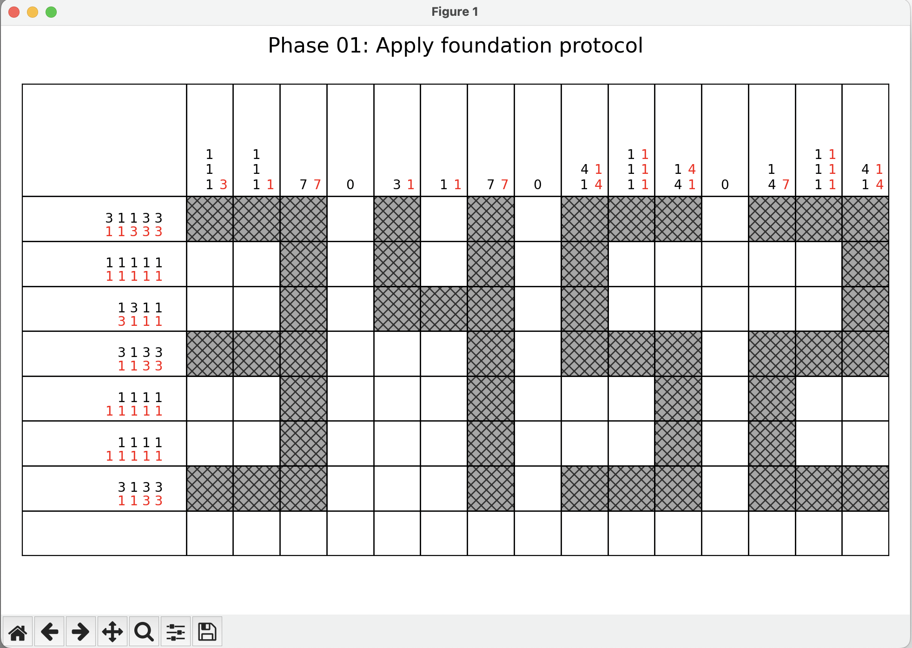
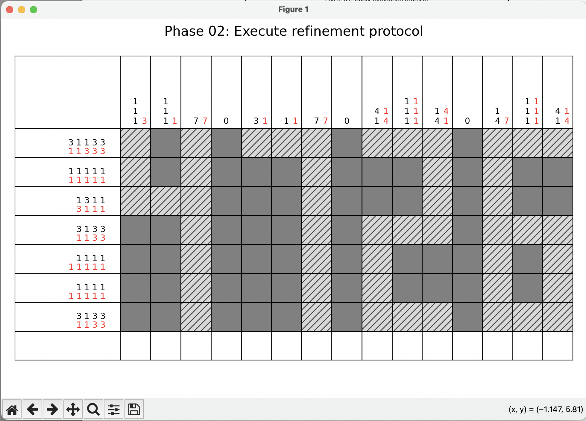

# Nonogram Puzzle Generator

> Now open source! Used to generate my puzzle "Refinement Protocol" for the [2025 Microsoft Puzzle Safari](https://25.puzzlesafari.net/Home/AfterEventWithScores)

This is a "two-phase" nonogram puzzle generator. These are the instructions provided to players:


> **LUMON INDUSTRIES — MACRODATA REFINEMENT DIVISION**
> 
> Refiners, your next data sequence requires completion in two phases:
>
> **Phase 01:** Apply foundation protocol by shading cells according to the **BLACK** sequences.
>
> **Phase 02:** Fill remaining cells, then perform refinement by erasing cells according to the **RED** sequences.
>
> Refer to the employee handbook for more information: https://en.wikipedia.org/wiki/Nonogram
>
> _Note: Refinement tools (pencil and eraser) suggested. This work is mysterious and important._


### Usage

Run with no arguments to enter 'new puzzle' mode, or pass an existing puzzle through standard input to view/modify an existing puzzle.  See examples on file format.
```
python -m venv venv
source venv/bin/activate
pip install -r requirements.txt

# Start from scratch
python squared_away.py

# Restore an existing puzzle
cat nonogram_puzzle_1.txt | python squared_away.py
```

1. Click on individual cells to shade.
2. To move to the next phase, tap <kbd>spacebar</kbd>
3. `nonogram_puzzle.txt` is generated

The `black` numbered clues are for the first phase, and the `red` numbered clues for the second.



